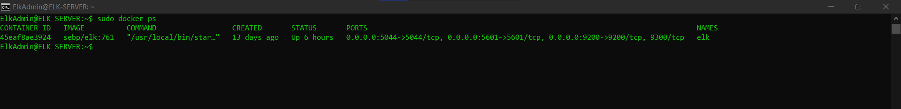

## Automated ELK Stack Deployment

The files in this repository were used to configure the network depicted below.

These files have been tested and used to generate a live ELK deployment on Azure. They can be used to either recreate the entire deployment pictured above. Alternatively, select portions of the YAML file may be used to install only certain pieces of it, such as Filebeat.

- [install-elk.yml](https://github.com/DanVal1269/scripts_repo/blob/main/ansible/ELK/install-elk.yml) 
- [filebeat-playbook.yml](https://github.com/DanVal1269/scripts_repo/blob/main/ansible/Filebeat/filebeat-playbook.yml)
- [metricbeat-playbook.yml](https://github.com/DanVal1269/scripts_repo/blob/main/ansible/Metricbeat/metricbeat-playbook.yml)

This document contains the following details:
- Description of the Topology
- Access Policies
- ELK Configuration
 - Beats in Use
 - Machines Being Monitored
- How to Use the Ansible Build

### Description of the Topology

The main purpose of this network is to expose a load-balanced and monitored instance of DVWA, the D*mn Vulnerable Web Application.

Load balancing ensures that the application will be highly available, in addition to restricting in-bound access to the network.

What aspect of security do load balancers protect? What is the advantage of a jump box?
- A load balancer distributes traffic across multiple servers automatically so that clients don’t have to monitor traffic or configure servers manually. The load balancer is located between clients and the servers providing extra security and performance.

- The jump box computer is used as a secured point that admins connect to first before connecting to other servers.

Integrating an ELK server allows users to easily monitor the vulnerable VMs for changes to the data and system logs.

What does Filebeat watch for?
- Filebeat watches for changes of files within the machine.

What does Metricbeat record?
- Metric collects metric data from the operating system and from services running on the server. 

The configuration details of each machine may be found below.

| Name       | Function   | IP Address | Operating System |
|------------|------------|------------|------------------|
| Jump box   | Gateway    | 10.0.0.4   |       Linux      |
| Web-1      | Webserver  | 10.0.0.7   |       Linux      |
| Web-2      | Webserver  | 10.0.0.8   |       Linux      |
| Web-3      | Webserver  | 10.0.0.9   |       Linux      |
| ELK-SERVER | Monitoring | 10.1.0.4   |       Linux      |

### Access Policies

The machines on the internal network are not exposed to the public Internet. 

Only the jump box machine can accept connections from the Internet. Access to this machine is only allowed from the following IP addresses:
- 5601 Kibana port

Machines within the network can only be accessed by jump box provisioner. 

- My Personal machine only has access to the ELK VM. My IP address xx.xxx.xx.xxx

A summary of the access policies in place can be found in the table below.

| Name       | Publicly Accessible | Allowed IP Addresses |
|------------|---------------------|----------------------|
| Jump box   | No                  | xx.xxx.xx.xxx        |
| Web-1      | No                  | 10.0.0.4             |
| Web-2      | No                  | 10.0.0.4             |
| Web-3      | No                  | 10.0.0.4             |
| ELK-SERVER | No                  | 10.0.0.4             |

### Elk Configuration

Ansible was used to automate configuration of the ELK machine. No configuration was performed manually, which is advantageous because it’s more fast and efficient without dealing with manual error which would be time consuming. An automated configuration is guaranteed to complete it’s tasks without error and the script can be modified to do more with precision.
 
The playbook implements the following tasks:

- installs docker.io, pip3, and the docker module 
- increases the virtual memory 
- uses sysctl module
- installs and launches the docker container for elk server

The following screenshot displays the result of running `docker ps` after successfully configuring the ELK instance.

### Target Machines & Beats
This ELK server is configured to monitor the following machines:
- Web-1 10.0.0.7
- Web-2 10.0.0.8
- Web-3 10.0.0.9

We have installed the following Beats on these machines:
- Filebeat
- Metricbeat

- Filebeat traffics log data for local files. Filebeat monitors log files and directories and forwards them to Elasticsearch for indexing. 
- Metricbeat collects and provides the metrics and stats of the machine or system. Using so, you can perform a system diagnosis by monitoring the memory and cpu usage of the system. 

### Using the Playbook
In order to use the playbook, you will need to have an Ansible control node already configured. Assuming you have such a control node provisioned: 

SSH into the control node and follow the steps below:
- Copy the configuration file to Web Vms `/etc/ansible`
- Update the `/etc/ansible/hosts` file to include the IP address of the Elk Server VM and webservers 
"`[Internal IP] ansible_python_interpreter=/usr/bin/python3`" 
- Run the playbook, and navigate to http://[Elk_VM_Public_IP]:5601/app/kibana to check that the installation worked as expected.
